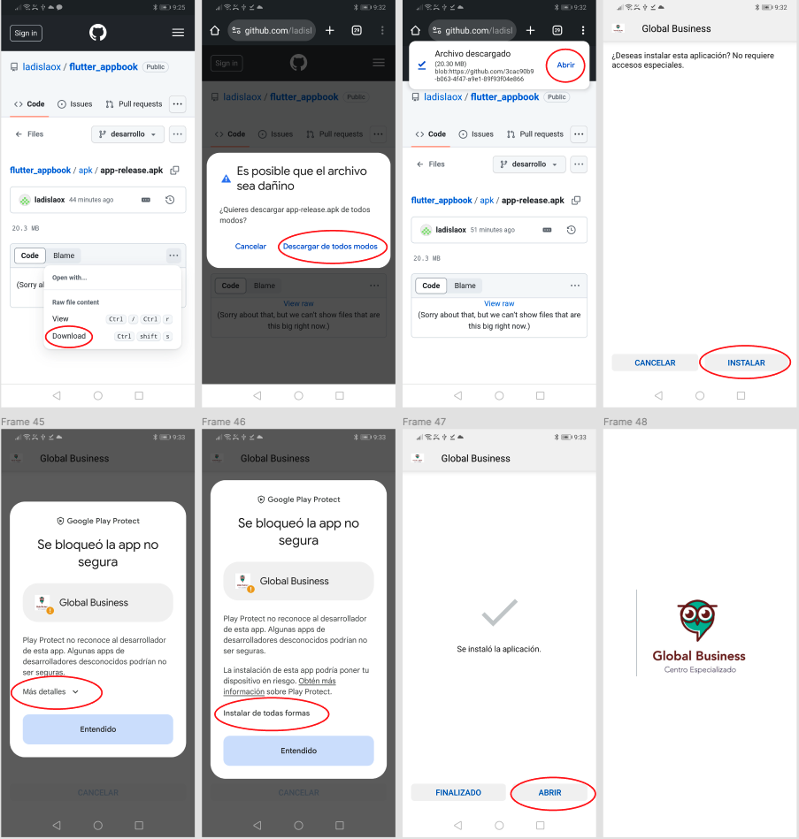
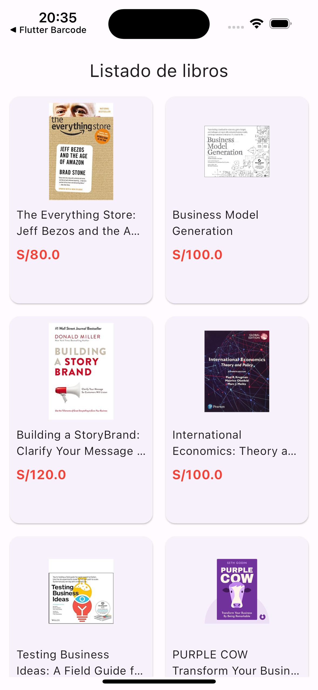
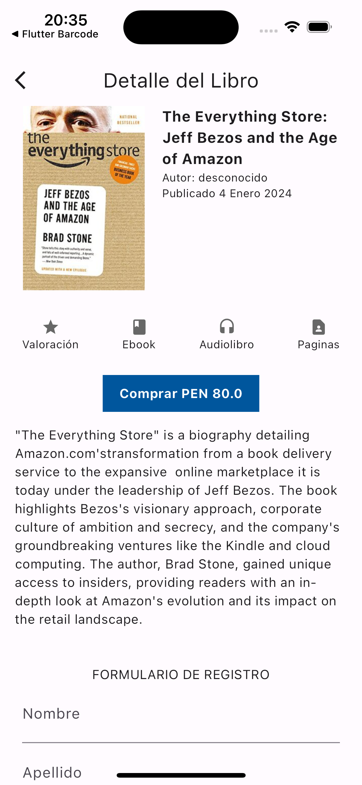
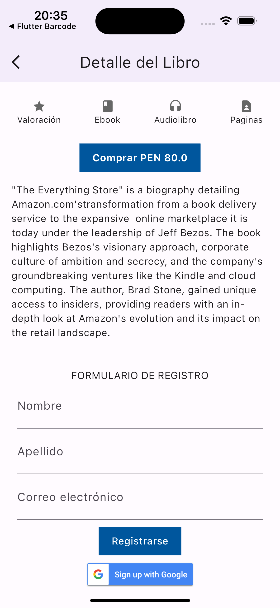
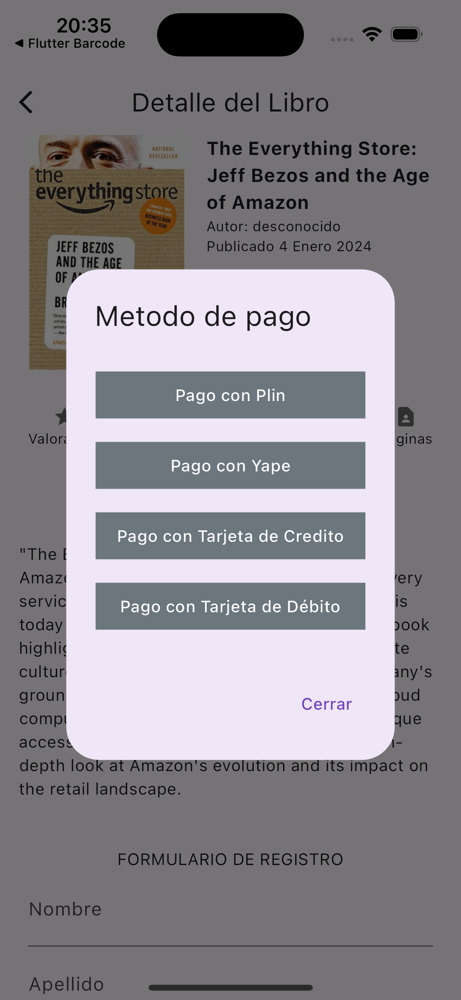

# flutter_applibros

Esta es un ejemplo de aplicación de libros desarrollada en `Flutter`.

## Listado de libros
En el listado de libros se creo una clase llamada `Book` donde hemos creado una lista(`List`) de libros para guardar toda la información de los 12 libros.

## Detalle del libro
Aqui se creo un objeto de tipo `Book` para recibir como parametro el libro selecionado.

- Muestra imagen del libro
- Muestra resumen
- Muestra precio
- Muestra modal de metodo de pago
- Muestra formulario de registro
- Muestra boton de login con Google

## Descargar app para Android
Ejemplo de como descargar e instalar la app

[Descargar apk](/apk/app-release.apk)

## Capturas de pantalla

